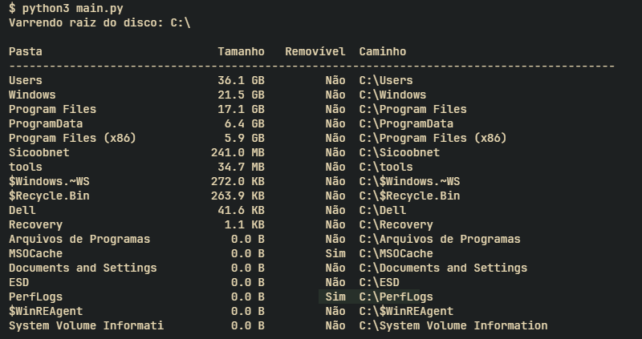

# Storage Reader

Storage Reader é um script em Python para Windows que analisa o disco do sistema e exibe informações detalhadas sobre o volume de dados ocupado por cada pasta na raiz (por exemplo, C:), além de sinalizar aquelas que podem ser removidas sem prejudicar o funcionamento do sistema (cache, temporários, logs etc.).

---

## Funcionalidades

- Varredura de toda a raiz do disco onde o Windows está instalado (por padrão, `C:\`).
- Cálculo do tamanho de cada pasta de primeiro nível usando threads para acelerar a operação.
- Identificação e sinalização de pastas consideradas “removíveis” (cache, temporários, logs, SoftwareDistribution, Prefetch etc.).
- Saída formatada no terminal com nome da pasta, tamanho legível, indicador de removível e caminho completo.

---

## Pré-requisitos

- Windows com Python 3.8 ou superior.
- Permissões suficientes para ler as pastas do sistema.

---

## Instalação

1. Clone o repositório:

   ```bash
   git clone https://github.com/herloncosta/storage-reader.git
   cd storage-reader
   ```

2. (Opcional) Crie e ative um ambiente virtual:

   ```bash
   python -m venv venv
   venv\\Scripts\\activate
   ```

---

## Uso

Execute o script diretamente no terminal:

```bash
python storage_reader.py
```

O script irá:

1. Detectar o drive de sistema (por exemplo `C:`).
2. Listar todas as pastas de primeiro nível na raiz.
3. Calcular tamanho de cada uma delas em paralelo.
4. Exibir no terminal nome, tamanho, indicador de removível e caminho.

---

## Exemplo de Saída



---

## Customização

Você pode editar a lista de pastas marcadas como seguras para remoção editando a variável `SAFE_SUBPATHS` dentro do arquivo `storage_reader.py`.

---

## Contribuição

Pull requests são bem-vindos! Para mudanças importantes, abra um _issue_ primeiro para discutirmos o que você gostaria de modificar.

---

## Licença

Este projeto está licenciado sob a MIT License. Consulte o arquivo [LICENSE](./LICENCE) para mais detalhes.
